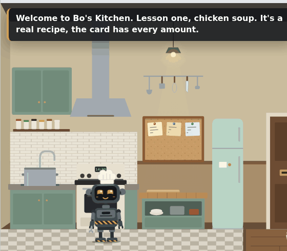
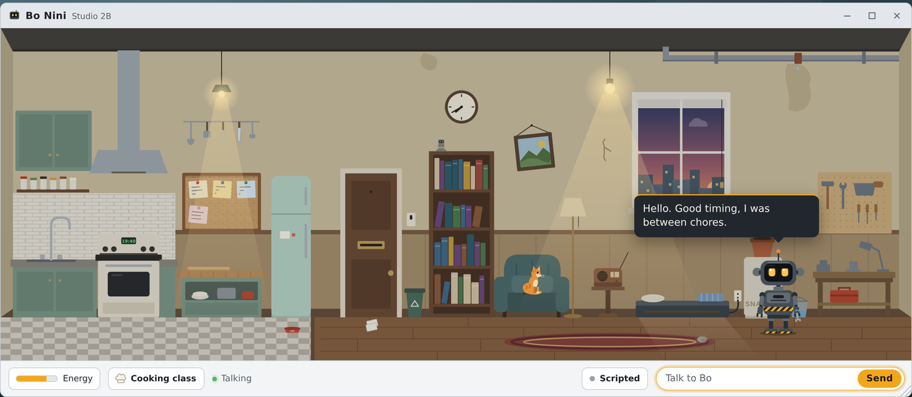
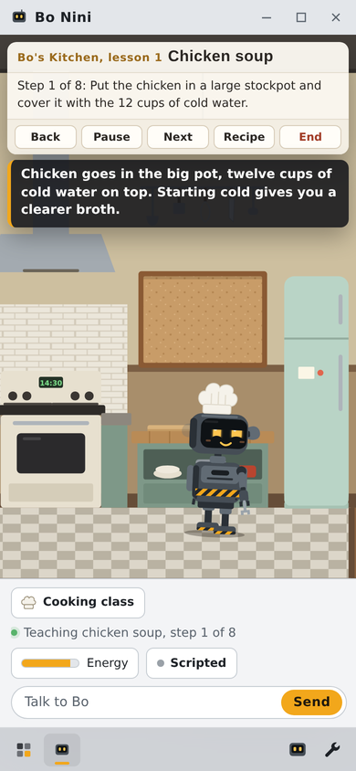

# Bo Nini: browser preview

Bo is a small robot who lives in a studio apartment on your desktop. It keeps its own routine, notices how long you've been gone, and remembers what you tell it.

This repo is an interactive **browser preview** of [Bo Nini](https://bonini.biz). It is not the desktop product. It's one web page that shows how Bo behaves.

**Try it:** open the live demo from the link in the About box on this page, or download `index.html` and open it in any modern browser. New here? Hit **Take the tour** at the bottom of the window for the 2-minute guided version, or add `?tour` to the end of the link to start the tour as soon as the page loads.

## What to try

- **Take the tour.** One click, and Bo shows the whole idea in about 2 minutes.
- **Turn the sound on.** Click the speaker at the top of the window. Bo talks out loud, the apartment has a quiet background hum, and you'll hear the drip, the welder, chopping and the cat. The same panel has the volume, mute, and a choice of Bo's voice (spoken, beeps or off). M mutes from anywhere.
- **Talk to Bo.** Tell it about something you're working on. Bo pins it to the corkboard in its kitchen and may ask how it went after you've been away.
- **Leave and come back.** Bo has a felt sense of time. The apartment ages while you're gone, and Bo reacts to how long it's been. The demo controls (the wrench in the taskbar) can simulate anything from 20 minutes to 3 weeks.
- **Take a cooking class.** Three real recipes: chicken soup, fluffy pancakes, and spaghetti with tomato sauce. Hit **Cooking class** and Bo teaches it step by step, with the full recipe on a card.
- **Watch the energy.** Energy is thinking. Each reply costs Bo a little, and its own chores are free. When the tank runs dry, Bo naps on its dock until you give it a snack. With your own AI key, thinking doesn't cost energy.
- **Meet the cat.** A ginger cat lives here too. It naps on the armchair, in the sunbeam, and on Bo's dock, sits in the window, and knocks things off the workbench. Bo feeds it and puts things back. Click it to say hi, or tell Bo its name.
- **Click things.** The leaky pipe, the lights, the radio, the fridge, the board, the window. Bo has a magnifying glass for close looks and a spyglass for the view.

## Live replies with your own AI key

Out of the box, Bo speaks in scripted lines. For live replies, click **Scripted** at the bottom of the window, pick a provider, paste your key, and hit **Connect**.

Supported: Anthropic, OpenAI, OpenRouter, Venice, a local Ollama, or any OpenAI-compatible API.

- Your key goes straight from your browser to the provider you picked. There is no server in between.
- The key is forgotten when you close the tab, unless you tick **Remember key**.
- Use a key with a spending limit.
- Some providers don't accept calls from web pages. For a local Ollama, set `OLLAMA_ORIGINS` to this site's address and restart Ollama.
- Every page on the same github.io address shares browser storage. If you host other pages there, don't tick **Remember key**.

## Privacy

Everything Bo remembers, from the board to the state of the apartment, is stored only in your browser. There are no accounts, analytics, or tracking scripts. The page does load its fonts from Google Fonts. To wipe everything, use **Reset Bo's world** in the demo controls.

## On a phone

It works on phones too. The camera follows Bo around the apartment.

## How it's built

A single self-contained HTML file: SVG for the art, plain JavaScript for Bo's behavior engine. No frameworks and no build step needed to run it.

The source is split into parts in `src/`. `build.sh` joins them back into `index.html`.

| File | What's in it |
| --- | --- |
| `src/1-head.html` | Page setup and all the styles |
| `src/2-scene.html` | The desktop, the app window, and the apartment art |
| `src/3-core.js` | Helpers, apartment state, lighting, saving |
| `src/3-sound.js` | The sound effects, all synthesized in the browser |
| `src/4-bo.js` | Bo's body, animation, speech, and daily routine |
| `src/5-kitchen.js` | The kitchen and the three cooking classes |
| `src/6-memory-brain.js` | The corkboard memory and the bring-your-own-key brain |
| `src/7-cat.js` | The cat and Bo's cat chores |
| `src/7-tour.js` | The 90-second guided tour |
| `src/8-app.js` | Energy, felt time, chat, controls, and startup |

## Status

v0.8.0, October 2026. An early preview: the art and behavior will keep changing.

## License

Copyright © 2026 Jack Hagman. All rights reserved. The code is public to read, but no license is granted to copy, modify, or redistribute it. See [LICENSE](LICENSE).

Join the waitlist at [bonini.biz](https://bonini.biz).
